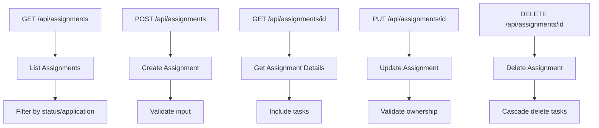
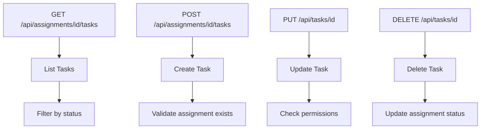
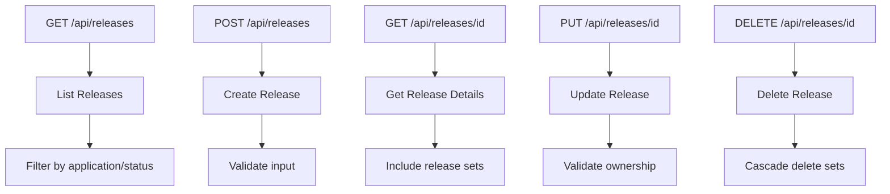
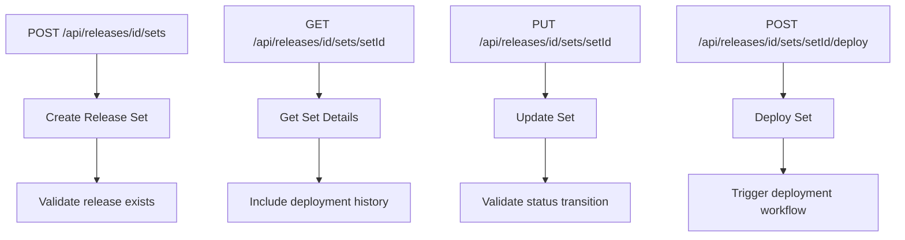
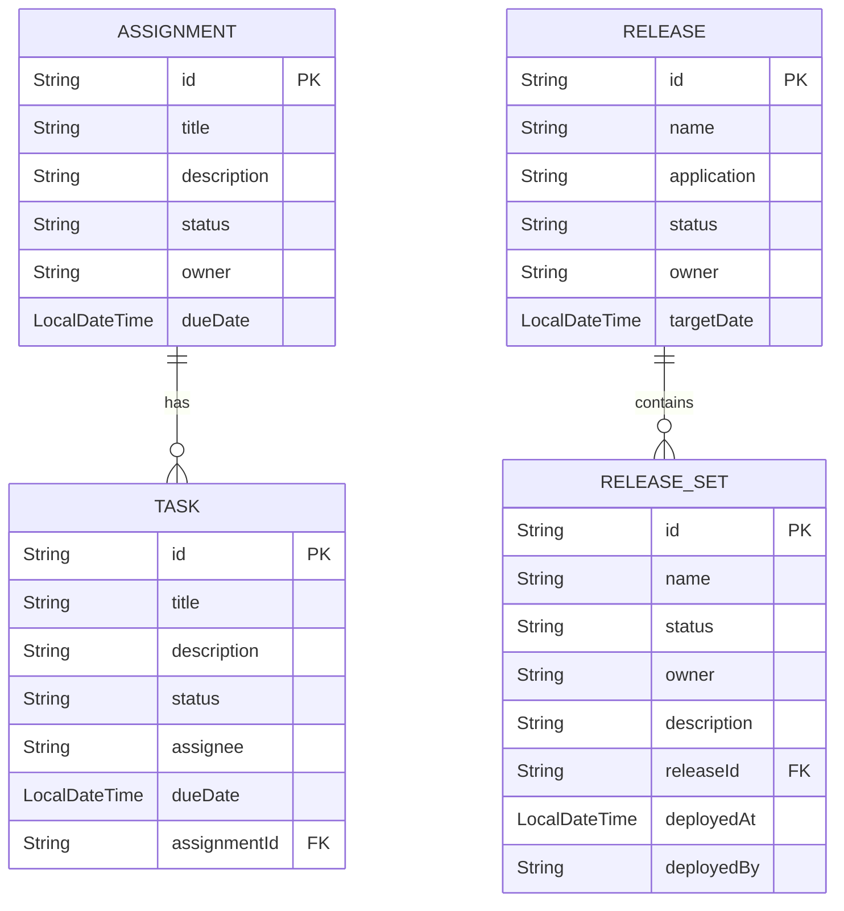
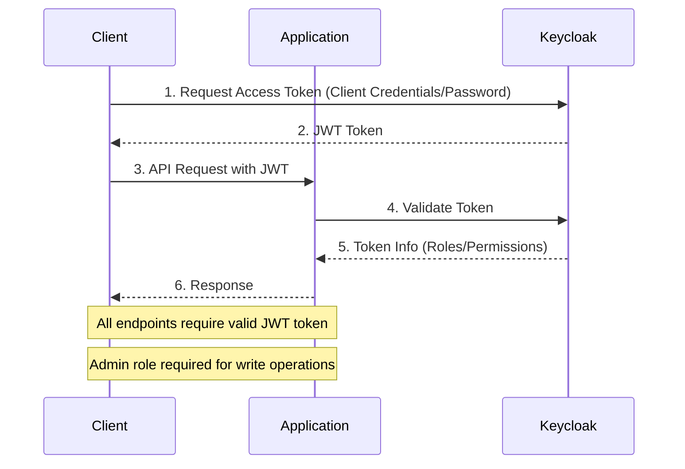
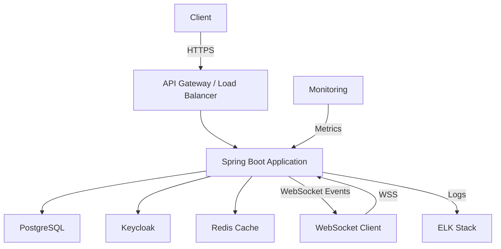
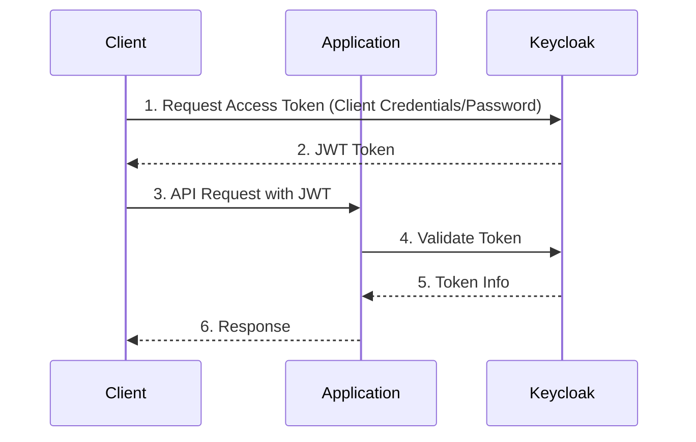
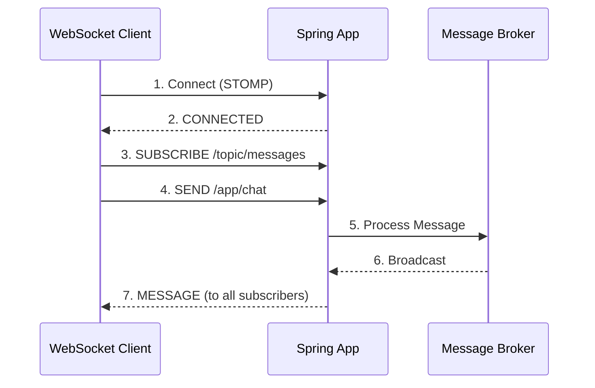

# CodePipeline MCP Java Spring OAuth2

A professional Java Spring Boot microservice with OAuth2 authentication and WebSocket capabilities following MCP (Model Context Protocol) design principles.

[](https://github.com/markbsigler/CodePipeline-MCP-JavaSpring-OAuth2/actions/workflows/maven.yml)
[](https://github.com/markbsigler/CodePipeline-MCP-JavaSpring-OAuth2/actions/workflows/codeql-analysis.yml)
[](https://opensource.org/licenses/MIT)

## 📑 Table of Contents

- [Quick Start](#-quick-start)
- [Features](#-features)
- [System Architecture](#-system-architecture)
- [API Documentation](#api-documentation)
- [Configuration](#-configuration)
- [Testing](#testing)
- [Deployment](#-deployment)
- [Security](#-security)
- [Contributing](#-contributing)
- [License](#-license)
- [Acknowledgments](#-acknowledgments)

## 🚀 Quick Start

1. **Clone the repository**
   ```bash
   git clone https://github.com/markbsigler/CodePipeline-MCP-JavaSpring-OAuth2.git
   cd CodePipeline-MCP-JavaSpring-OAuth2
   ```

2. **Start dependencies**
   ```bash
   docker-compose up -d
   ```

3. **Import Keycloak realm**
   - Go to [Keycloak Admin Console](http://localhost:8081/)
   - Login: `admin` / `admin`
   - Import: `keycloak/realm-export.json`

4. **Run the app**
   ```bash
   ./mvnw spring-boot:run -Dspring-boot.run.profiles=dev
   ```

5. **Access API**
   - [Swagger UI](http://localhost:8080/api/swagger-ui.html)
   - [API Base URL](http://localhost:8080/api)

---

## 🚀 Recent Updates

- **Enhanced Message Service**
  - Added input validation for message creation (null/empty checks for content and sender)
  - Improved error messages for validation failures
  - Fixed concurrency issues in message deletion
  - Added comprehensive test coverage for all service methods
  - Improved test reliability and isolation
  - Added proper cleanup in test cases
  - Fixed version handling in update operations

- **Infrastructure & Testing**
  - Upgraded to **Testcontainers 1.19.7** for better Java 17 compatibility
  - Added **PostgreSQL Testcontainers** integration for reliable database testing
  - Implemented comprehensive **MessageRepository** integration tests with real database
  - Added **BasePostgresRepositoryTest** for consistent test setup
  - Improved test isolation with **@DataJpaTest** and proper transaction management
  - Added **PostgresTestConfig** for container configuration
  - Implemented comprehensive test cases for all CRUD operations
  - Added test coverage for custom repository methods
  - Improved test reliability with proper container lifecycle management

## 📋 ISPW API Implementation

### Overview
This service implements the ISPW API specification, providing endpoints for managing assignments, tasks, releases, and release sets. The implementation follows RESTful principles and includes comprehensive error handling, validation, and security.

### API Endpoints

#### Assignment Management


#### Task Management


#### Release Management


#### Release Set Management


### Data Model



### Authentication Flow



### Error Handling

The API returns appropriate HTTP status codes and error messages in the following format:

```json
{
    "timestamp": "2025-06-05T19:45:30.123456Z",
    "status": 404,
    "error": "Not Found",
    "message": "Release not found with id: 123",
    "path": "/api/releases/123"
}
```

Common error responses include:
- `400 Bad Request`: Invalid input data
- `401 Unauthorized`: Missing or invalid authentication
- `403 Forbidden`: Insufficient permissions
- `404 Not Found`: Resource not found
- `409 Conflict`: Resource conflict (e.g., duplicate name)
- `500 Internal Server Error`: Server-side error

### Rate Limiting

All endpoints are protected by rate limiting:
- 100 requests per minute per authenticated user
- 1000 requests per minute per IP for public endpoints

### Monitoring

All endpoints are instrumented for monitoring:
- Request/response metrics
- Error rates
- Response times
- Active connections

### Security Headers

All responses include security headers:
- `Content-Security-Policy`
- `X-Content-Type-Options: nosniff`
- `X-Frame-Options: DENY`
- `X-XSS-Protection: 1; mode=block`
- `Strict-Transport-Security: max-age=31536000 ; includeSubDomains`

## 🏗️ System Architecture

### High-Level Architecture



### Authentication Flow



### WebSocket Message Flow



## 🚀 Features

### Core Features

- **Spring Boot 3.2** with Java 17
  - Modern Java features and performance improvements
  - Auto-configuration and standalone deployment

- **Security**
  - **OAuth2 Resource Server** with JWT validation
  - **Keycloak** integration for identity management
  - **Role-based access control** (RBAC)
  - **CSRF protection**
  - **CORS** configuration

- **Real-time Communication**
  - **WebSocket** support with STOMP protocol
  - **Message broadcasting** and direct messaging
  - **User presence** tracking
  - **Event-driven** architecture

- **Data Layer**
  - **PostgreSQL** with **Spring Data JPA**
  - **Flyway** for database migrations
  - **QueryDSL** for type-safe queries
  - **Auditing** (createdAt, updatedAt, etc.)

- **API**
  - **RESTful** endpoints
  - **OpenAPI 3.0** documentation with **Swagger UI**
  - **HATEOAS** for discoverable APIs
  - **Pagination** and **filtering**
  - **Validation** and **error handling**

- **DevOps**
  - **Docker** and **Docker Compose** support
  - **Maven** build system
  - **Git** version control
  - **CI/CD** ready

- **Monitoring**
  - **Spring Boot Actuator**
  - **Health checks**
  - **Metrics** with Prometheus
  - **Distributed tracing**

- **Testing**
  - **JUnit 5** for unit and integration testing
  - **TestContainers** for integration testing with real databases
  - **PostgreSQL Testcontainers** for reliable database testing
  - **@DataJpaTest** for repository layer testing
  - **MockMVC** for controller testing
  - **Test coverage** reports with JaCoCo
  - **Test profiles** for different environments
  - **Container reuse** for faster test execution

## 🛠️ Prerequisites

- **Java Development Kit (JDK) 17** or later
  - [Download Eclipse Temurin JDK 17](https://adoptium.net/)
  - Verify: `java -version`
  - Required for Java 17 language features and modules

- **Maven 3.9+** or **Gradle 8+**
  - [Install Maven](https://maven.apache.org/install.html)
  - Verify: `mvn -v`

- **Docker and Docker Compose**
  - [Install Docker Desktop](https://www.docker.com/products/docker-desktop)
  - Verify: `docker --version` and `docker-compose --version`

- **Database**
  - PostgreSQL 14+ (included in Docker Compose)
  - Or install [PostgreSQL](https://www.postgresql.org/download/) locally

- **IDE** (Recommended)
  - [IntelliJ IDEA](https://www.jetbrains.com/idea/)
  - [VS Code](https://code.visualstudio.com/) with Java extensions
  - [Eclipse](https://www.eclipse.org/downloads/)

- **API Testing Tools**
  - [Postman](https://www.postman.com/)
  - [cURL](https://curl.se/)
  - [httpie](https://httpie.io/)

## 🧪 Testing

### Unit Tests

Run all unit tests:
```bash
./mvnw test
```

### Integration Tests

Integration tests require Docker (for Testcontainers). If Docker is not available, these tests will be skipped automatically.

Run integration tests:
```bash
./mvnw verify -Pintegration-test
```

- Integration tests use H2 in PostgreSQL mode by default, but some tests may use Testcontainers for a real PostgreSQL instance.
- Test data is isolated and rolled back after each test using `@Transactional`.
- Test reliability is improved by parameterized tests and Docker availability checks.

### Test Reliability Features
- **Automatic rollback**: All tests are transactional and roll back changes after each test.
- **Docker check**: Integration tests that require Docker will be skipped if Docker is not available.
- **Parameterized tests**: Repeated validation scenarios are covered with parameterized tests for maintainability and coverage.

## 🚀 Getting Started

### Local Development Setup

1. **Clone the repository**
   ```bash
   git clone https://github.com/markbsigler/CodePipeline-MCP-JavaSpring-OAuth2.git
   cd CodePipeline-MCP-JavaSpring-OAuth2
   ```
   
   Or using SSH:
   ```bash
   git clone git@github.com:markbsigler/CodePipeline-MCP-JavaSpring-OAuth2.git
   cd CodePipeline-MCP-JavaSpring-OAuth2
   ```

2. **Start the infrastructure**
   ```bash
   docker-compose up -d
   ```
   This will start:
   - PostgreSQL database
   - Keycloak OAuth2 server
   - PgAdmin (optional, for database management)

3. **Configure Keycloak**
   - Access Keycloak Admin Console: http://localhost:8081/
   - Login with `admin/admin`
   - Import the realm configuration from `keycloak/realm-export.json`

4. **Run the application**
   ```bash
   # Using Maven wrapper
   ./mvnw spring-boot:run -Dspring-boot.run.profiles=dev
   
   # Or build and run the JAR
   ./mvnw clean package
   java -jar target/codepipeline-mcp-0.0.1-SNAPSHOT.jar
   ```

5. **Access the application**
   - **API Base URL**: http://localhost:8080/api
   - **Swagger UI**: http://localhost:8080/api/swagger-ui.html
   - **H2 Console**: http://localhost:8080/api/h2-console
     - JDBC URL: `jdbc:h2:mem:testdb`
     - Username: `sa`
     - Password: (leave empty)

6. **Test Users**
   - **Admin User**
     - Username: `admin`
     - Password: `admin`
     - Roles: `ROLE_ADMIN`, `ROLE_USER`
   - **Regular User**
     - Username: `user`
     - Password: `password`
     - Roles: `ROLE_USER`

### 🧪 Testing the Application

#### Running Tests

1. **Run all tests**
   ```bash
   ./mvnw clean test
   ```

2. **Run integration tests with Testcontainers**
   ```bash
   # Make sure Docker is running
   docker --version
   
   # Run integration tests
   ./mvnw test -Dtest=*IT
   ```

3. **Run a specific test class**
   ```bash
   ./mvnw test -Dtest=MessageRepositoryIT
   ```

4. **Run a specific test method**
   ```bash
   ./mvnw test -Dtest=MessageRepositoryIT#shouldSaveMessage
   ```

5. **Generate test coverage report**
   ```bash
   ./mvnw clean verify
   # Report will be available at: target/site/jacoco/index.html
   ```

#### Test Configuration

- Tests use **Testcontainers** with **PostgreSQL 14**
- Test data is automatically cleaned up between tests
- Database schema is managed by **Hibernate** in test profile
- Tests run with **JUnit 5** and **AssertJ** for assertions

#### Test Profiles

- `test`: Default profile for unit tests (in-memory H2 database)
- `itest`: Integration test profile (PostgreSQL Testcontainer)

To run with a specific profile:
```bash
./mvnw test -Pitest
```

6. **Generate JaCoCo coverage report**
   ```bash
   ./mvnw jacoco:report
   # Open target/site/jacoco/index.html in browser
   ```

## 📚 API Documentation

### Authentication

1. **Get Access Token**
   ```http
   POST /auth/realms/mcp/protocol/openid-connect/token
   Content-Type: application/x-www-form-urlencoded
   
   client_id=mcp-client
   &username=user
   &password=password
   &grant_type=password
   &client_secret=your-client-secret
   ```

2. **Using the Access Token**
   ```http
   GET /api/messages
   Authorization: Bearer <access_token>
   ```

### Available Endpoints

#### Messages

- `GET /api/messages` - Get all messages (paginated)
- `GET /api/messages/{id}` - Get message by ID
- `POST /api/messages` - Create a new message
- `PUT /api/messages/{id}` - Update a message
- `DELETE /api/messages/{id}` - Delete a message
- `GET /api/messages/search?query={query}` - Search messages

#### WebSocket Endpoints

- `/ws` - WebSocket endpoint
- `/topic/messages` - Subscribe to message updates
- `/queue/private` - Private message queue
- `/app/chat` - Send a message

### Example Requests

**Create a Message**
```http
POST /api/messages
Content-Type: application/json
Authorization: Bearer <access_token>

{
  "content": "Hello, World!",
  "recipient": "user2"
}
```

**Subscribe to Messages**
```javascript
const socket = new SockJS('/ws');
const stompClient = Stomp.over(socket);

stompClient.connect({}, function(frame) {
    console.log('Connected: ' + frame);
    
    // Subscribe to public messages
    stompClient.subscribe('/topic/messages', function(message) {
        console.log('New message: ' + message.body);
    });
    
    // Subscribe to private messages
    stompClient.subscribe('/user/queue/private', function(message) {
        console.log('Private message: ' + message.body);
    });
});
```

## 🔧 Configuration

### Environment Variables

Create a `.env` file in the project root with the following variables:

```env
# Application
SERVER_PORT=8080
SERVER_SERVLET_CONTEXT_PATH=/api

# Database
SPRING_DATASOURCE_URL=jdbc:postgresql://localhost:5432/mcp_db
SPRING_DATASOURCE_USERNAME=postgres
SPRING_DATASOURCE_PASSWORD=postgres

# JPA/Hibernate
SPRING_JPA_HIBERNATE_DDL_AUTO=update
SPRING_JPA_SHOW_SQL=true

# OAuth2 Resource Server
SPRING_SECURITY_OAUTH2_RESOURCESERVER_JWT_ISSUER_URI=http://localhost:8081/realms/mcp
SPRING_SECURITY_OAUTH2_RESOURCESERVER_JWT_JWK_SET_URI=http://localhost:8081/realms/mcp/protocol/openid-connect/certs

# Logging
LOGGING_LEVEL_ORG_SPRINGFRAMEWORK_WEB=INFO
LOGGING_LEVEL_COM_CODEPIPELINE=DEBUG

# Actuator
MANAGEMENT_ENDPOINTS_WEB_EXPOSURE_INCLUDE=health,info,metrics
MANAGEMENT_ENDPOINT_HEALTH_SHOW_DETAILS=always
```

## 🚀 Deployment

### Docker Deployment

1. **Build the application**
   ```bash
   ./mvnw clean package -DskipTests
   docker build -t codepipeline-mcp .
   ```

2. **Run with Docker Compose**
   ```bash
   # For development
   docker-compose -f docker-compose.yml -f docker-compose.dev.yml up -d
   
   # For production
   docker-compose -f docker-compose.yml -f docker-compose.prod.yml up -d
   ```

### Kubernetes Deployment

1. **Create Kubernetes secrets**
   ```bash
   kubectl create secret generic db-secret \
     --from-literal=username=postgres \
     --from-literal=password=postgres
   ```

2. **Deploy the application**
   ```bash
   kubectl apply -f k8s/
   ```

## 🛡️ Security

### Authentication Flow

1. Client requests an access token from Keycloak
2. Keycloak issues a JWT token
3. Client includes the token in the `Authorization` header
4. Resource server validates the token and checks scopes/roles

### Security Headers

The application includes the following security headers by default:
- Content Security Policy (CSP)
- X-Content-Type-Options
- X-Frame-Options
- X-XSS-Protection
- Strict-Transport-Security (HSTS)

## 📊 Monitoring

### Actuator Endpoints

| Endpoint | Description |
|----------|-------------|
| `/actuator/health` | Application health information |
| `/actuator/info` | Application information |
| `/actuator/metrics` | Application metrics |
| `/actuator/prometheus` | Prometheus metrics |

### Logging

Logs are written to `logs/application.log` and can be configured in `logback-spring.xml`.

## 🤝 Contributing

1. Fork the repository
2. Create your feature branch (`git checkout -b feature/AmazingFeature`)
3. Commit your changes (`git commit -m 'Add some AmazingFeature'`)
4. Push to the branch (`git push origin feature/AmazingFeature`)
5. Open a Pull Request

## 📄 License

This project is licensed under the MIT License - see the [LICENSE](LICENSE) file for details.

## 🙏 Acknowledgments

- [Spring Boot](https://spring.io/projects/spring-boot)
- [Spring Security](https://spring.io/projects/spring-security)
- [Keycloak](https://www.keycloak.org/)
- [Docker](https://www.docker.com/)
- [Kubernetes](https://kubernetes.io/)
- [PostgreSQL](https://www.postgresql.org/)
- [WebSocket](https://spring.io/guides/gs/messaging-stomp-websocket/)

## 🏗️ Project Structure

```
.
├── src/
│   ├── main/
│   │   ├── java/com/codepipeline/mcp/
│   │   │   ├── config/          # Configuration classes
│   │   │   ├── controller/      # REST controllers
│   │   │   ├── dto/            # Data Transfer Objects
│   │   │   ├── exception/      # Exception handling
│   │   │   ├── model/          # JPA entities
│   │   │   ├── repository/     # Spring Data repositories
│   │   │   ├── security/       # Security configurations
│   │   │   ├── service/        # Business logic
│   │   │   └── websocket/      # WebSocket configurations
│   │   └── resources/
│   │       ├── application.yml       # Main configuration
│   │       ├── application-dev.yml   # Development profile
│   │       └── application-prod.yml  # Production profile
│   └── test/                    # Test classes
├── .github/                    # GitHub workflow files
├── docker/                     # Docker configuration files
├── k8s/                        # Kubernetes manifests
├── keycloak/                   # Keycloak configuration
├── .gitignore
├── docker-compose.yml
├── Dockerfile
├── mvnw
├── pom.xml
└── README.md
```

### Key Components

- **`config/`**: Spring configuration classes
  - `SecurityConfig.java`: Security configuration
  - `WebSocketConfig.java`: WebSocket configuration
  - `OpenAPIConfig.java`: OpenAPI/Swagger configuration

- **`controller/`**: REST controllers
  - `MessageController.java`: Message REST endpoints
  - `WebSocketController.java`: WebSocket message handling

- **`model/`**: JPA entities
  - `Message.java`: Message entity with JPA annotations

- **`service/`**: Business logic
  - `MessageService.java`: Message business logic

- **`security/`**: Security configurations
  - `JwtRoleConverter.java`: JWT role conversion
  - `SecurityUtils.java`: Security utilities

- **`websocket/`**: WebSocket components
  - `WebSocketEventListener.java`: WebSocket event handling
  - `WebSocketMessageBrokerConfig.java`: WebSocket broker configuration

## API Documentation

API documentation is available at runtime using Swagger UI:
- Swagger UI: http://localhost:8080/api/swagger-ui.html
- OpenAPI JSON: http://localhost:8080/api/v3/api-docs

## Testing

Run unit tests:
```bash
./mvnw test
```

Run integration tests (requires Docker):
```bash
./mvnw verify -Pintegration-test
```

## Building for Production

Build the application:
```bash
./mvnw clean package -DskipTests
```

## Docker

Build Docker image:
```bash
docker build -t codepipeline-mcp .
```

Run with Docker Compose:
```bash
docker-compose up -d
```

## Deployment

### Kubernetes

Deploy to Kubernetes:
```bash
kubectl apply -f k8s/
```

### Cloud Platforms

The application can be deployed to any cloud platform that supports Docker containers:
- AWS ECS/EKS
- Google Cloud Run/GKE
- Azure Container Apps/AKS
- Heroku

## Security

- OAuth2 with JWT tokens
- Role-based access control (RBAC)
- CSRF protection
- CORS configuration
- Secure headers
- Input validation

## Contributing

1. Fork the repository
2. Create your feature branch (`git checkout -b feature/AmazingFeature`)
3. Commit your changes (`git commit -m 'Add some AmazingFeature'`)
4. Push to the branch (`git push origin feature/AmazingFeature`)
5. Open a Pull Request

## License

This project is licensed under the MIT License - see the [LICENSE](LICENSE) file for details.

## Acknowledgments

- [Spring Boot](https://spring.io/projects/spring-boot)
- [Spring Security](https://spring.io/projects/spring-security)
- [Keycloak](https://www.keycloak.org/)
- [Docker](https://www.docker.com/)
- [Kubernetes](https://kubernetes.io/)
